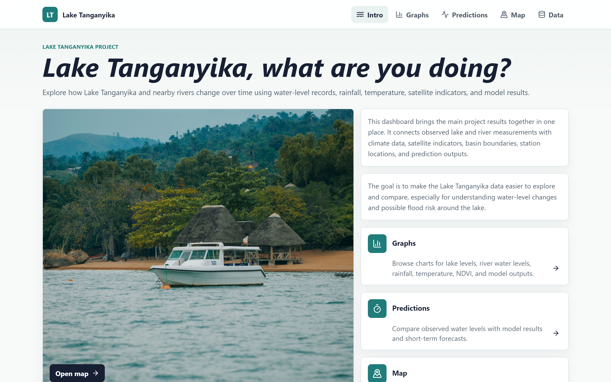
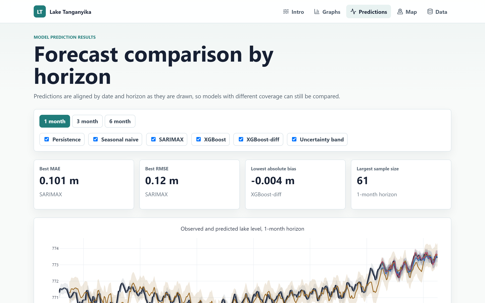
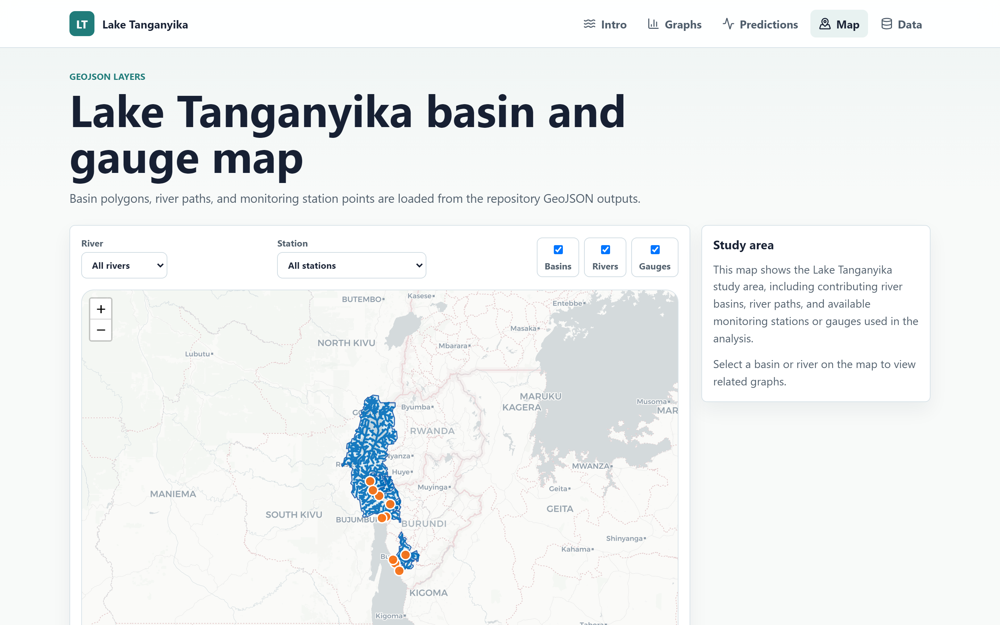
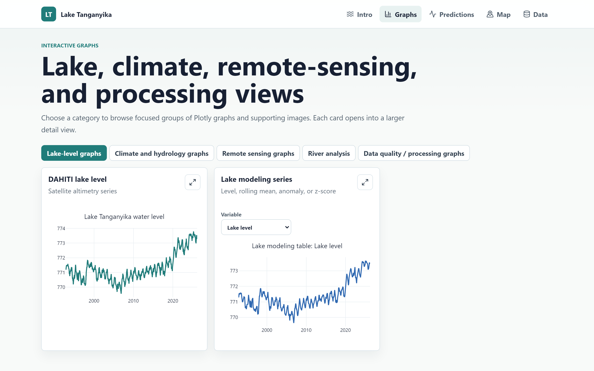
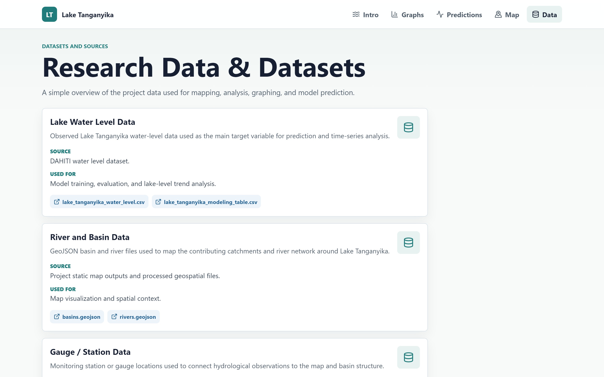

# Lake Tanganyika Water-Level Forecasting

**Can we see the lake's future? Monthly water-level forecasts for Lake Tanganyika, driven by satellite altimetry, ERA5 climate reanalysis, and river-gauge data — benchmarked from naïve baselines all the way to gradient-boosted trees.**

Lake Tanganyika — the world's second-largest freshwater lake by volume — has risen sharply since 2020, threatening shoreline communities and infrastructure in Burundi, Tanzania, the DRC, and Zambia. This project turns open climate and hydrology data into 1-, 3-, and 6-month-ahead water-level forecasts, and rigorously measures how much skill each model adds over a simple "next month looks like this month" guess. It also bundles the supporting data-engineering, vegetation, and geospatial workstreams plus an interactive visualization website.

---

## Highlights

On a strict out-of-sample test over the most recent 5 years (expanding-window, no future leakage):

| Horizon | Best model | MAE (m) | Skill vs. persistence |
|:-------:|:-----------|:-------:|:---------------------:|
| 1 month | SARIMAX | **0.10** | +0.44 |
| 3 months | SARIMAX | **0.15** | +0.68 |
| 6 months | SARIMAX | **0.18** | +0.77 |

*A differenced XGBoost variant lands a close second and shows why tree models must be trained on **changes**, not absolute levels, to forecast a trending lake. Full breakdown in [`reports/metrics_extended.csv`](reports/metrics_extended.csv); narrative in [`docs/PIPELINE.md`](docs/PIPELINE.md).*

---

## 🖥️ The Product — Interactive Dashboard

All results ship as an interactive **React + TypeScript + Vite** dashboard (Plotly charts, Leaflet map) so the analysis is explorable, not just a folder of CSVs.

> **🔗 Live demo:** **https://luukjanssen9.github.io/Lake-Tanganyika/** &nbsp;·&nbsp; Run locally: `cd website && npm install && npm run dev`

<p align="center">
  
</p>

|  |  |
|:--:|:--:|
|  |  |
| **Predictions** — observed vs. forecast lake level per horizon, with model skill metrics and an uncertainty band | **Map** — basin polygons, river network, and monitoring stations on an interactive Leaflet map |
|  |  |
| **Graphs** — lake level, climate, remote-sensing, and data-quality views | **Data** — every dataset with its source and processed files |

---

## Architecture / Data Flow

```
┌──────────────────────────────────────────────────────────────────────────┐
│  DATA ACQUISITION            scripts/download/                             │
│                                                                            │
│  Copernicus CDS ──► download/era5/*.py         ──► data/era5/csv_monthly/  │
│  DAHITI altimetry ─► download_dahiti_...py     ──► data/outputs/dahiti/    │
│  JRC water / MODIS NDVI ─► download_jrc/ndvi.py ─► data/outputs/{jrc,ndvi}/│
│  River gauges (provided)                        ──► data/station_level/    │
└──────────────────────────────────────────────────────────────────────────┘
                                    │
                                    ▼
┌──────────────────────────────────────────────────────────────────────────┐
│  FEATURE ENGINEERING         scripts/forecasting/01_build_lake_level_table │
│    merge target + climate + rivers on a monthly grid; lags {1,2,3,6,12},   │
│    rolling means, seasonal anomalies, cumulative precip anomalies          │
│                       ──►  data/processed/lake_tanganyika_modeling_table.csv│
└──────────────────────────────────────────────────────────────────────────┘
                                    │
                                    ▼
┌──────────────────────────────────────────────────────────────────────────┐
│  MODELING & EVALUATION       scripts/forecasting/                          │
│    02_baselines          persistence · seasonal-naïve  (the floor)         │
│    03_sarimax            SARIMAX(1,1,1)(1,1,1,12) + climate exog           │
│    04_xgboost            gradient-boosted trees on absolute level          │
│    05_xgboost_differences   same, but predicts ΔL  (trend-safe)           │
│                       ──►  reports/*_predictions.csv, *_metrics.csv        │
└──────────────────────────────────────────────────────────────────────────┘
                                    │
                                    ▼
┌──────────────────────────────────────────────────────────────────────────┐
│  REPORTING                                                                 │
│    06_metrics_extended   MAE · RMSE · NRMSE · skill scores                 │
│    07_plot_validation    slide-ready RMSE-by-horizon chart                 │
│    reports/figures/make_report_figures.py   observed-vs-predicted panels   │
└──────────────────────────────────────────────────────────────────────────┘
```

---

## Features

- **End-to-end, reproducible pipeline** — from raw ERA5 download to publication-ready charts, each stage is a self-contained script run in numeric order.
- **Leakage-safe evaluation** — expanding-window rolling forecasts; exogenous climate drivers are filled with *training-only* seasonal climatology so no future information leaks into any forecast.
- **Honest benchmarking** — every model is scored against persistence and seasonal-naïve baselines, with skill scores that make "did this actually help?" unambiguous.
- **Rich feature engineering** — calendar encodings, multi-scale lags and rolling means, seasonal z-score anomalies, and cumulative precipitation anomalies over 3–36 month windows.
- **Two complementary model families** — a classical state-space model (SARIMAX) and gradient-boosted trees, including a differenced variant that solves the trend-extrapolation problem trees suffer from.
- **Automated data acquisition** — scripted, resumable downloads for ERA5 (eight catchment grid cells), DAHITI altimetry, JRC surface water, and MODIS NDVI.
- **Companion analyses** — per-river imputation, vegetation/NDVI seasonality, and a geospatial static-map builder live under [`analysis/`](analysis/).
- **Interactive website** — a map-based visualization of the catchment and stations in [`website/`](website/).

---

## Prerequisites

- **Python 3.12** (tested; 3.10+ should work)
- A free **[Copernicus Climate Data Store](https://cds.climate.copernicus.eu/) account** — only needed to regenerate ERA5 inputs from scratch
- (Optional) **Node.js 18+** to run the visualization website in `website/`

The **regenerable** raw data (ERA5 hourly CSVs, NetCDF, and `data/raw/`) is git-ignored. The small model inputs you need — the ERA5 monthly aggregates, the river gauges, and the processed tables — are committed, so the forecasting pipeline runs out of the box.

---

## Installation

```bash
# 1. Clone
git clone <your-repo-url> lake-tanganyika
cd lake-tanganyika

# 2. Create and activate a virtual environment
python -m venv .venv
source .venv/bin/activate        # Windows: .venv\Scripts\Activate.ps1

# 3. Install dependencies
pip install -r requirements.txt
```

To (re)download ERA5 data, add your CDS credentials to `~/.cdsapirc`:

```
url: https://cds.climate.copernicus.eu/api
key: <your-personal-access-token>
```

---

## Usage

All scripts are anchored to the repository root, so run them **from the repo root** in numeric order.

### Run the full forecasting pipeline

```bash
python scripts/forecasting/01_build_lake_level_table.py   # build the feature table
python scripts/forecasting/02_baselines.py                # persistence + seasonal-naïve
python scripts/forecasting/03_sarimax.py                  # SARIMAX + climate exogenous
python scripts/forecasting/04_xgboost.py                  # gradient-boosted trees (level)
python scripts/forecasting/05_xgboost_differences.py      # gradient-boosted trees (Δlevel)
python scripts/forecasting/06_metrics_extended.py         # consolidated skill scores
python scripts/forecasting/07_plot_validation.py          # RMSE-by-horizon chart
python reports/figures/make_report_figures.py             # observed-vs-predicted panels
```

Each script logs progress and prints a summary table. For example, `02_baselines.py` reports:

```
Baseline metrics (lower MAE / RMSE is better; bias near 0 is better):

     model  horizon_months  period    n   mae_m  rmse_m  bias_m
persistence               1 overall  ...   ...     ...     ...
```

### (Optional) Regenerate ERA5 inputs from scratch

```bash
python scripts/download/era5/download_era5.py        # ~10 min: 8 grid cells, 1940–present
python scripts/download/era5/download_era5_extra.py   # dewpoint + sea-level pressure
python scripts/download/era5/convert_to_csv.py        # NetCDF → hourly CSV
python scripts/download/era5/aggregate_monthly.py      # hourly → monthly CSV (model input)
```

### Outputs

| File | Contents |
|------|----------|
| `data/processed/lake_tanganyika_modeling_table.csv` | Monthly feature matrix (target + ~125 predictors) |
| `reports/*_predictions.csv` | Per-model, per-horizon forecasts aligned by target date |
| `reports/model_comparison.csv` | All models side by side on the recent-5-year window |
| `reports/metrics_extended.csv` | MAE, RMSE, NRMSE, and skill scores |
| `reports/figures/*.png` | Validation and observed-vs-predicted charts |

---

## Project Layout

```
.
├── data/
│   ├── era5/csv_monthly/     # ERA5 monthly aggregates (model inputs; raw/hourly are git-ignored)
│   ├── outputs/              # DAHITI, JRC, NDVI, per-river, imputed, master dataset
│   ├── processed/            # monthly target + engineered modeling table
│   └── station_level/        # 12 river-gauge time series
├── scripts/
│   ├── forecasting/          # 05–11 modeling pipeline
│   ├── download/             # data acquisition (era5/, dahiti, jrc, ndvi)
│   └── processing/           # master-dataset builder
├── reports/                  # metrics, predictions, figures/, eda/
├── analysis/                 # per_river/, vegetation/, static_map/
├── docs/                     # PIPELINE.md, SLIDES.md, data catalog / lineage / missing-data
├── website/                  # interactive map visualization (Vite + React)
├── requirements.txt
└── README.md
```

---

## Contributing

Contributions are welcome! To propose a change:

1. Fork the repository and create a feature branch: `git checkout -b feature/my-improvement`
2. Keep the numbered-script convention — each pipeline stage stays self-contained and runnable on its own from the repo root.
3. Match the existing style (module-level docstring describing inputs/outputs, `logging` over bare `print`, meters as the water-level unit).
4. Do not commit regenerable bulk data (raw ERA5, NetCDF) — it is git-ignored by design.
5. Ensure the pipeline still runs end to end before opening a pull request, and include before/after metrics if you touched a model.

Bug reports and feature ideas are equally welcome via the issue tracker.

---

## License

_License to be determined._ Add a `LICENSE` file (e.g. [MIT](https://choosealicense.com/licenses/mit/)) before public release. Until then, all rights reserved by the authors.

---

## Acknowledgements & Data Sources

- **ERA5** reanalysis — Copernicus Climate Change Service (C3S) Climate Data Store
- **DAHITI** — satellite altimetry water levels, DGFI-TUM
- **JRC Global Surface Water** & **MODIS NDVI** — auxiliary catchment indicators
- Developed as part of a University of Maastricht research project.
